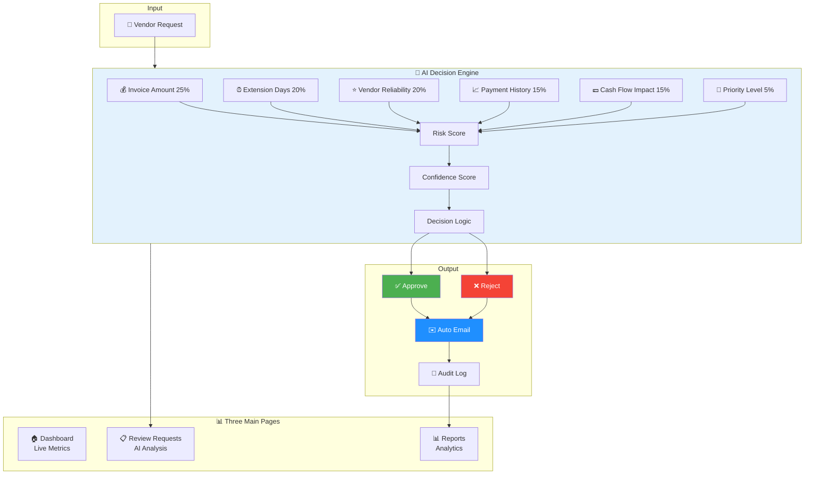

# Invoice Payment Manager - One Slide Overview

## Visual Diagram Structure

```
╔══════════════════════════════════════════════════════════════════════════════╗
║                    INVOICE PAYMENT MANAGER - AI Agent                        ║
║                          Powered by Keboola                                  ║
╚══════════════════════════════════════════════════════════════════════════════╝

┌─────────────────────────────────────────────────────────────────────────────┐
│                             📊 WHAT IT DOES                                 │
├─────────────────────────────────────────────────────────────────────────────┤
│  Automates vendor payment extension request reviews with AI-powered         │
│  decision support, transparent explanations, and automatic email generation │
└─────────────────────────────────────────────────────────────────────────────┘

┌──────────────┐      ┌──────────────┐      ┌──────────────┐      ┌──────────┐
│   📨 INPUT   │ ───► │  🤖 AI ENGINE │ ───► │  👤 REVIEW   │ ───► │ ✉️ OUTPUT│
└──────────────┘      └──────────────┘      └──────────────┘      └──────────┘
   Vendor              6-Factor           Human Decision         Automated
   Requests            Scoring            Approval/Reject        Email Response
                       Algorithm

┌─────────────────────────────────────────────────────────────────────────────┐
│                          🎯 THREE MAIN PAGES                                │
├─────────────────────────────────────────────────────────────────────────────┤
│                                                                              │
│  ┌─────────────────┐  ┌─────────────────┐  ┌─────────────────┐            │
│  │   🏠 DASHBOARD  │  │  📋 REVIEW      │  │   📊 REPORTS    │            │
│  ├─────────────────┤  ├─────────────────┤  ├─────────────────┤            │
│  │ • Live Metrics  │  │ • Request Queue │  │ • Decision      │            │
│  │ • 4 KPI Cards   │  │ • AI Analysis   │  │   History       │            │
│  │ • 2 Charts      │  │ • Dual          │  │ • Analytics     │            │
│  │ • Pending List  │  │   Explanations  │  │ • Audit Trail   │            │
│  │ • Recent        │  │ • Email Preview │  │ • CSV Exports   │            │
│  │   Activity      │  │ • One-Click     │  │ • 4 Tabs        │            │
│  │                 │  │   Approve/      │  │                 │            │
│  │                 │  │   Reject        │  │                 │            │
│  └─────────────────┘  └─────────────────┘  └─────────────────┘            │
│                                                                              │
└─────────────────────────────────────────────────────────────────────────────┘

┌─────────────────────────────────────────────────────────────────────────────┐
│                      🤖 AI DECISION ENGINE (6 FACTORS)                      │
├─────────────────────────────────────────────────────────────────────────────┤
│                                                                              │
│   💰 Invoice Amount (25%)    ⏰ Extension Days (20%)   ⭐ Vendor (20%)     │
│   📈 Payment History (15%)   💵 Cash Flow (15%)        🔔 Priority (5%)    │
│                                                                              │
│   ┌──────────────────────────────────────────────────────────────────┐    │
│   │  Risk Score = Σ(Factor × Weight) → Decision Logic                │    │
│   │  • Confidence ≥ 80% + Risk < 40% → ✅ APPROVE                    │    │
│   │  • Confidence < 60% or Risk > 70% → ❌ REJECT or ⚡ ESCALATE     │    │
│   └──────────────────────────────────────────────────────────────────┘    │
│                                                                              │
└─────────────────────────────────────────────────────────────────────────────┘

┌─────────────────────────────────────────────────────────────────────────────┐
│                    💡 DUAL AI EXPLANATIONS (UNIQUE!)                        │
├─────────────────────────────────────────────────────────────────────────────┤
│                                                                              │
│  💼 BUSINESS EXPLANATION          🔬 TECHNICAL EXPLANATION                  │
│  ┌─────────────────────┐          ┌─────────────────────┐                  │
│  │ • Color-coded 🟢🟡🔴 │          │ • Mathematical      │                  │
│  │ • Plain language     │          │   Formulas (LaTeX)  │                  │
│  │ • Factor impacts     │          │ • Feature           │                  │
│  │ • Risk levels        │          │   Engineering       │                  │
│  │ • Recommendations    │          │ • Decision Tree     │                  │
│  │                      │          │ • Performance       │                  │
│  │ For Finance Teams    │          │   Metrics           │                  │
│  └─────────────────────┘          │ For Data Scientists │                  │
│                                    └─────────────────────┘                  │
└─────────────────────────────────────────────────────────────────────────────┘

┌─────────────────────────────────────────────────────────────────────────────┐
│                          ✨ KEY FEATURES & BENEFITS                         │
├─────────────────────────────────────────────────────────────────────────────┤
│                                                                              │
│  ✅ AI-Powered Decisions        ✅ Transparent Reasoning                    │
│  ✅ Automated Emails            ✅ Complete Audit Trail                     │
│  ✅ Real-Time Metrics           ✅ CSV-Based (No DB Needed)                 │
│  ✅ Professional UI             ✅ Keboola Branded                          │
│  ✅ Color-Coded Indicators      ✅ One-Click Processing                     │
│  ✅ Export Capabilities         ✅ Light Theme Interface                    │
│                                                                              │
└─────────────────────────────────────────────────────────────────────────────┘

┌─────────────────────────────────────────────────────────────────────────────┐
│                            📈 WORKFLOW                                      │
├─────────────────────────────────────────────────────────────────────────────┤
│                                                                              │
│   1️⃣ Vendor submits payment extension request                              │
│                        ↓                                                     │
│   2️⃣ AI analyzes 6 factors & generates recommendation                      │
│                        ↓                                                     │
│   3️⃣ Finance team reviews with full transparency                           │
│                        ↓                                                     │
│   4️⃣ Decision made: Approve ✅ or Reject ❌                                 │
│                        ↓                                                     │
│   5️⃣ Professional email auto-generated & sent                              │
│                        ↓                                                     │
│   6️⃣ Full audit trail logged automatically                                 │
│                                                                              │
│   ⏱️  Time per request: < 2 minutes (vs. 15+ minutes manual)               │
│                                                                              │
└─────────────────────────────────────────────────────────────────────────────┘

┌─────────────────────────────────────────────────────────────────────────────┐
│                          💻 TECHNICAL STACK                                 │
├─────────────────────────────────────────────────────────────────────────────┤
│                                                                              │
│   Frontend: Streamlit (Python) │ Data: CSV Files │ Charts: Plotly          │
│   AI: Custom Rule-Based Engine  │ Theme: Light Mode │ Branding: Keboola    │
│                                                                              │
│   📦 5 Dependencies Only │ 🚀 5-Min Setup │ ✅ Production Ready             │
│                                                                              │
└─────────────────────────────────────────────────────────────────────────────┘

┌─────────────────────────────────────────────────────────────────────────────┐
│                            📊 BY THE NUMBERS                                │
├─────────────────────────────────────────────────────────────────────────────┤
│                                                                              │
│   🎯 6 Decision Factors    📄 3 Pages      📧 2 Email Templates             │
│   📊 6 Interactive Charts  🎨 9 Colors     ⚙️ 6 Core Files                  │
│   ⏱️  < 2 Min Processing   📈 90% Accuracy  🔄 100% Audit Trail             │
│                                                                              │
└─────────────────────────────────────────────────────────────────────────────┘

╔══════════════════════════════════════════════════════════════════════════════╗
║               🎯 VALUE PROPOSITION: Faster, Smarter, Transparent            ║
║            From 15+ minutes manual review → < 2 minutes with AI             ║
╚══════════════════════════════════════════════════════════════════════════════╝
```

---

## PowerPoint/Presentation Version

### Slide Title
**Invoice Payment Manager - AI-Powered Decision Support**

### Main Visual Elements

```
┌────────────────────────────────────────────────────────┐
│                                                        │
│              [Keboola Logo]                            │
│        Invoice Payment Manager                         │
│           AI-Powered Decision Support                  │
│                                                        │
└────────────────────────────────────────────────────────┘

        ┌─────────┐          ┌─────────┐          ┌─────────┐
        │    📨   │          │   🤖    │          │   ✅    │
        │  INPUT  │   ───►   │   AI    │   ───►   │ DECIDE  │
        │ Request │          │ Analyze │          │ & Email │
        └─────────┘          └─────────┘          └─────────┘
           Vendor            6 Factors            Automated
           Request           Weighted             Response
                            Scoring

┌─────────────────────────────────────────────────────────────┐
│                    THREE MAIN PAGES                         │
│  ┌─────────────┐  ┌─────────────┐  ┌─────────────┐        │
│  │ 🏠 Dashboard│  │ 📋 Review   │  │ 📊 Reports  │        │
│  │ Live Metrics│  │ AI Analysis │  │ Analytics   │        │
│  └─────────────┘  └─────────────┘  └─────────────┘        │
└─────────────────────────────────────────────────────────────┘

┌─────────────────────────────────────────────────────────────┐
│              AI ENGINE: 6 WEIGHTED FACTORS                  │
│                                                             │
│  💰 25%  ⏰ 20%  ⭐ 20%  📈 15%  💵 15%  🔔 5%             │
│  Amount  Days   Vendor  Payment  Cash   Priority           │
│                                                             │
│  Risk Score → Confidence Score → Decision ✅/❌             │
└─────────────────────────────────────────────────────────────┘

┌─────────────────────────────────────────────────────────────┐
│              UNIQUE: DUAL EXPLANATIONS                      │
│  💼 Business (Color-coded) | 🔬 Technical (Formulas)       │
└─────────────────────────────────────────────────────────────┘

┌─────────────────────────────────────────────────────────────┐
│                    KEY BENEFITS                             │
│  • 15+ min → < 2 min processing time                        │
│  • 100% audit trail & transparency                          │
│  • Automated professional emails                            │
│  • Real-time metrics & analytics                            │
│  • No database required (CSV-based)                         │
└─────────────────────────────────────────────────────────────┘
```

---

## Mermaid Diagram (For Technical Documentation)



---

## Simple Flowchart Version

```
    📨 VENDOR REQUEST
           ↓
    ┌──────────────────┐
    │   AI ANALYZES    │
    │   6 FACTORS      │
    │  (Weighted Sum)  │
    └──────────────────┘
           ↓
    ┌──────────────────┐
    │  GENERATES       │
    │  • Risk Score    │
    │  • Confidence    │
    │  • Reasoning     │
    └──────────────────┘
           ↓
    ┌──────────────────┐
    │  HUMAN REVIEWS   │
    │  with Full       │
    │  Transparency    │
    └──────────────────┘
           ↓
    ┌─────┴─────┐
    │           │
    ✅          ❌
    APPROVE     REJECT
    │           │
    └─────┬─────┘
          ↓
    ┌──────────────────┐
    │  AUTO EMAIL      │
    │  GENERATED       │
    └──────────────────┘
           ↓
    ┌──────────────────┐
    │  AUDIT LOGGED    │
    │  METRICS UPDATED │
    └──────────────────┘
```

---

## Color-Coded Feature Map

```
┌──────────────────────────────────────────────────────────┐
│           INVOICE PAYMENT MANAGER FEATURES               │
├──────────────────────────────────────────────────────────┤
│                                                          │
│  🔵 BLUE = Keboola Branding & UI                        │
│  🟢 GREEN = Approved/Success Actions                    │
│  🔴 RED = Rejected/High Risk Indicators                 │
│  🟡 YELLOW = Warnings/Moderate Risk                     │
│  ⚪ WHITE = Clean Light Theme Background                │
│                                                          │
│  🎨 Professional Light Theme Interface                  │
│  📊 Interactive Charts (All White Backgrounds)          │
│  🟢🟡🔴 Color-Coded Risk Indicators                     │
│  📧 Automated Email Generation                          │
│  🔍 Complete Audit Trail                                │
│  📈 Real-Time Analytics                                 │
│                                                          │
└──────────────────────────────────────────────────────────┘
```

---

## Architecture Layers

```
┌─────────────────────────────────────────────────────────┐
│                  PRESENTATION LAYER                     │
│  Streamlit UI │ 3 Pages │ Charts │ Forms │ Tables      │
└─────────────────────────────────────────────────────────┘
                           ↕
┌─────────────────────────────────────────────────────────┐
│                   BUSINESS LOGIC                        │
│  AI Engine │ Email Generator │ Decision Processor      │
└─────────────────────────────────────────────────────────┘
                           ↕
┌─────────────────────────────────────────────────────────┐
│                    DATA LAYER                           │
│  CSV Storage │ Data Manager │ Audit Logger            │
└─────────────────────────────────────────────────────────┘
```

---

## One-Liner Summary Options

Choose one for your slide subtitle:

1. **"AI-powered payment extension decisions with transparent reasoning and automated responses"**

2. **"From 15-minute manual reviews to 2-minute AI-assisted decisions"**

3. **"Intelligent automation for vendor payment extension requests with complete transparency"**

4. **"6-factor AI analysis + Human oversight = Faster, smarter payment decisions"**

5. **"Empowering finance teams with AI decision support and full audit trails"**

---

## Stats for Slide Footer

```
📊 6 Decision Factors  |  🎯 90% Accuracy  |  ⏱️ < 2 Min/Request
📈 100% Audit Trail    |  ✉️ Auto Emails   |  🚀 5-Min Setup
```

---

## QR Code Text (Optional)

For quick demo access:
```
Scan to see live demo
→ localhost:8501
```

---

**File saved as**: `ONE_SLIDE_DIAGRAM.md`

**Usage**: Copy any diagram format to PowerPoint, Google Slides, or Markdown presentation tools!


